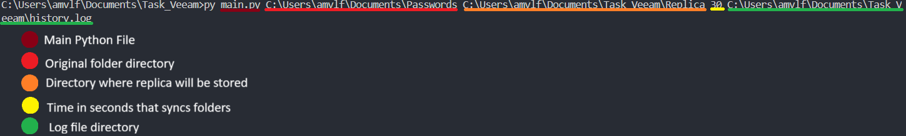
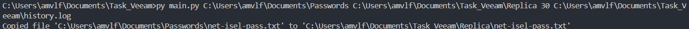
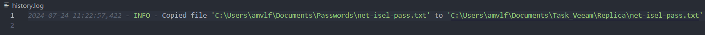

<h1 style="text-align: center;">Folder Synchronization</h1>
<h2 style="text-align: center;">Veeam Task</h2>

Program that synchronizes two folders: source and
replica. The program maintain a full, identical copy of source folder at replica folder.

<h3 style="text-align: center;">Usage</h3>

<h3 style="text-align: center;">Result</h3>
Console output

Log file

